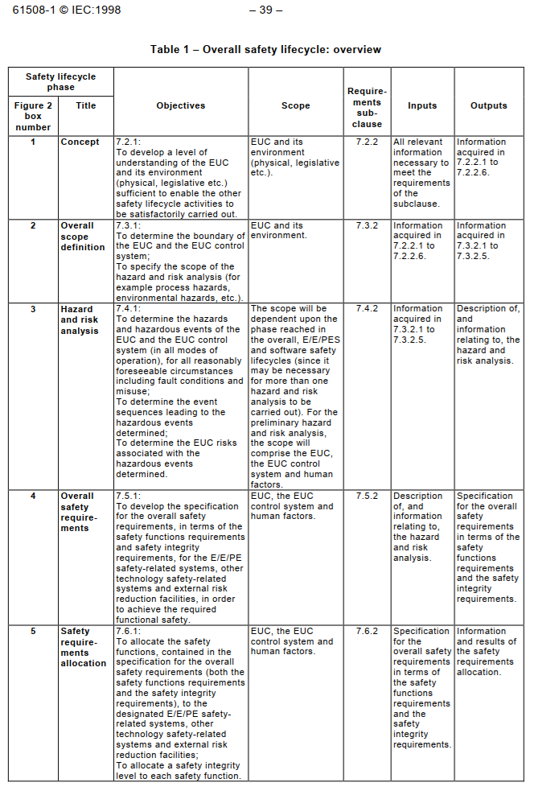

## What is functional safety?

https://www.tuvsud.com/en-us/services/functional-safety/about
https://instrunexus.com/what-is-functional-safety-a-beginners-guide-to-iec-61511-iec-61508/
https://www.tuev-nord.de/en/services/audit-and-expertise/product-certification/functional-safety/
https://en.wikipedia.org/wiki/Functional_safety
https://en.wikipedia.org/wiki/IEC_61508

### Definition

“part of the overall safety relating to the EUC (Equipment Under Control) and the EUC control system which depends on the correct functioning of the E/E/PE safety-related systems, other technology safety-related systems and external risk reduction facilities.” (According to IEC 61508)
Source: https://en.wikipedia.org/wiki/IEC_61508

E/E/PE safety-related systems: electrical, electronic, or programmable electronic safety-related systems
Correct Functioning: The system must operate as intended under all relevant conditions.
Inputs: These can be process variables (e.g., temperature, pressure, level), operator commands, or internal signals.
Response to Errors and Failures: The safety system must be designed to either prevent dangerous failures or, if they occur, to detect them and initiate a safe shutdown or other protective action.
https://instrunexus.com/what-is-functional-safety-a-beginners-guide-to-iec-61511-iec-61508/

Functional safety is, [...], “Protecting a user from technology”. It also protects technology from users. More technically however, the definition of Functional Safety is, “Systems that lead to the freedom from unacceptable risk of injury or damage to the health of people by the proper implementation of one or more automatic protection functions (often called safety functions). A safety system consists of one or more safety functions.”
Source: https://www.tuvsud.com/en-us/services/functional-safety/about

### Purpose of Functional Safety

The purpose of functional safety is to protect the user, directly, or indirectly (e.g. via environmental
damage or money loss) from harm.

In manufacturing facilities for instance, functional safety is critical to safe operation. Functional safety systems can give operators far better operational metrics and control of the equipment under use. From a business standpoint – functional safety allows manufacturers to operate closer to their margins with confidence in a well-defined functional safety environment. This benefits them in terms of increased efficiencies, fewer downtimes, and the resulting cost savings.
Source: https://www.tuvsud.com/en-us/services/functional-safety/about

### The Functional Safety Lifecycle

In order to manage functional safety, IEC_61508 introduces a safety lifecycle, which includes the following
phases:

- Concept Phase: Defining the scope and objectives of the safety-related system.
- Overall Scope Definition: Identifying the overall boundaries of the system under consideration.
- Hazard and Risk Assessment: Identifying potential hazards and assessing the associated risks.
- Allocation of Safety Functions to Protection Layers: Determining which safety functions are necessary and how they will be implemented across different layers of protection, including the SIS.
- Safety Requirements Specification: Defining the detailed requirements for each safety function, including its required SIL.
- Design and Implementation (E/E/PE System Hardware): Designing and selecting the hardware components of the SIS.
- Design and Implementation (Application Software): Developing the software for programmable electronic logic solvers.
- Validation: Confirming that the designed and implemented SIS meets the specified safety requirements.
- Installation, Commissioning, and Final Acceptance: Installing, testing, and formally accepting the SIS.
- Operation and Maintenance: Establishing procedures for the safe operation and maintenance of the SIS, including proof testing and fault management.
- Modification: Managing any changes to the SIS throughout its operational life.
- Decommissioning: Safely removing the SIS from service at the end of its lifecycle.

Source: https://instrunexus.com/what-is-functional-safety-a-beginners-guide-to-iec-61511-iec-61508/

