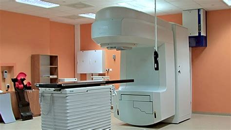
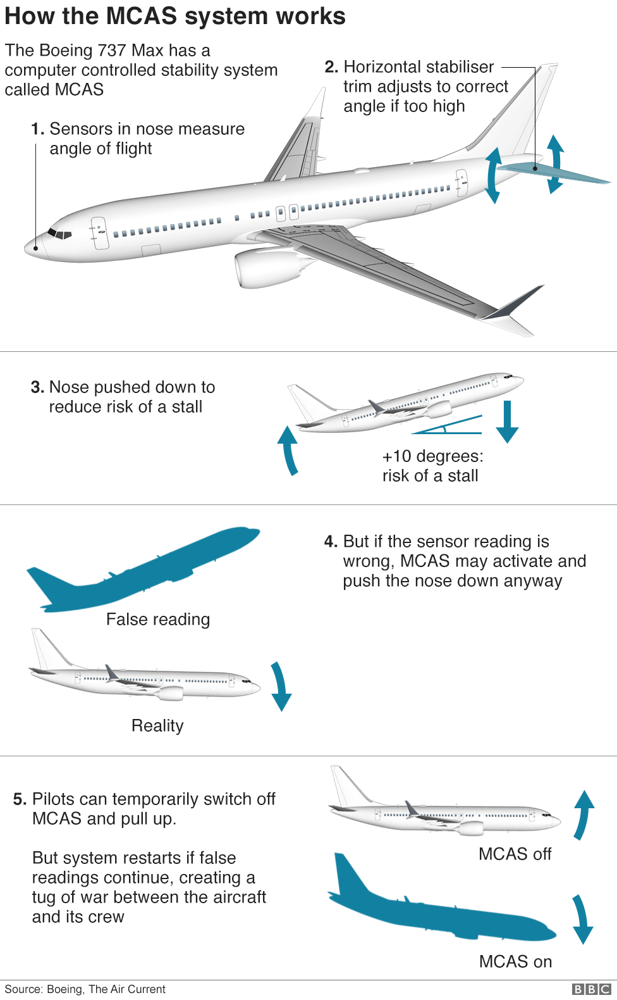

## Why is functional safety important? Find examples beside the Ariane 5, 3 Mile Island, Fukushima and Chernobyl

### Importance of Functional Safety

Adding functional safety is very important because it reduces the risk of catastrophic damage if critical systems are failing to an acceptable level. There are many examples in the past where bogus or non-existent functional safety mechanisms caused catastrophic damage:

### Therac 25 Incident

The Therac-25 is a computer-controlled radiation therapy machine produced by Atomic Energy of Canada Limited (AECL) in 1982. It was involved in at least six accidents between 1985 and 1987, in which some patients were given massive overdoses of radiation. Because of concurrent programming errors (also known as race conditions), it sometimes gave its patients radiation doses that were hundreds of times greater than normal, resulting in death or serious injury.

The Therac-25 was designed as a machine controlled by a computer, with some safety mechanisms switched from hardware to software as a result. AECL decided not to duplicate some safety mechanisms, and reused modules and code routines from the Therac-20 for the Therac-25.

The software for the Therac-25 was developed by one person over several years using PDP-11 assembly language. It was an evolution of the Therac-6 software. In 1986, the programmer left AECL. In a subsequent lawsuit, lawyers were unable to identify the programmer or learn about his qualification and experience. 

The Therac-25 operated in three modes, "field light", "electron-beam therapy", "Megavolt X-ray". The controlling software detected the modes via microswitches attached to the turntable onto which the devices were mounted.

Two software faults could cause patients to be exposed to electron radiation 100 times more intensive than intended. Six accidents were reported, in three of them, the patients died.

Some of the identified root causes for the accidents were:

- No independent code review was conducted by AECL
- The control software was not considered during the failure mode analysis
- Operators were reassured that radiation overdosing was impossible
- No tests HW-SW were conducted on the Therac 25 before its assembly in the customer hospitals
- The Therac-25 predecessors had hardware interlocks installed which masked failures in the software. The software was taken over to Therac-25, but the hardware interlocks were removed.

Source: https://en.wikipedia.org/wiki/Therac-25

Source: https://android.com.pl/tech/544665-therac-25-radioterapia-smierc-rtg/

### Boeing 737 MAX MCAS System

Because the CFM International LEAP engine used on the 737 MAX was larger and mounted further forward from the wing and higher off the ground than on previous generations of the 737, Boeing discovered that the aircraft had a tendency to push the nose up when operating in a specific portion of the flight envelope (flaps up, high angle of attack, manual flight).
https://en.wikipedia.org/wiki/Maneuvering_Characteristics_Augmentation_System

MCAS was intended to mimic the flight behavior of the previous Boeing 737 Next Generation. The company indicated that this change eliminated the need for pilots to have simulator training on the new aircraft.
https://en.wikipedia.org/wiki/Maneuvering_Characteristics_Augmentation_System#cite_note-1

The revised design allowed MCAS to trigger on the inputs of a single sensor, instead of two factors considered in the original plan. Boeing engineers considered that lack of redundancy acceptable, [...], because they calculated the probability of a “hazardous” MCAS malfunction to be virtually inconceivable.

As Boeing and the FAA advanced the 737 MAX toward production, they limited the scrutiny and testing of the MCAS design. Then they agreed not to inform pilots about MCAS in manuals, even though Boeing’s safety analysis expected pilots to be the primary backstop in the event the system went haywire.

The original version of MCAS was activated only if two distinct sensors indicated such an extreme maneuver: a high angle of attack (angle between the wing and the oncoming air flow) and a high G-force (plane’s acceleration in the vertical direction).

Source: https://www.bbc.co.uk/news/world-africa-47553174

In 2016, during flight tests, Boeing made substantial changes to the MCAS to support low-speed flight conditions, removing the G-force sensor as input. As a consequence, MCAS was now activated
by (and depended on) a single data source, the angle-of-attack sensor.

That angle-of-attack sensor gave false readings in two Boeing 737 Max flights, activating the MCAS system which caused the planes to crash.

https://www.afacwa.org/the_inside_story_of_mcas_seattle_times
