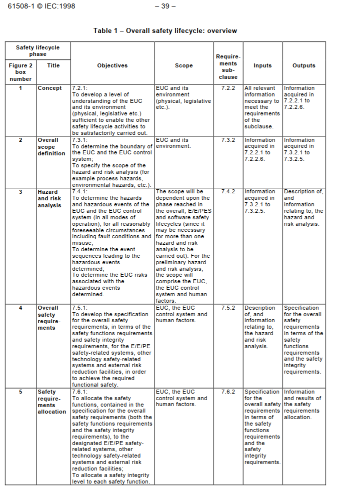

## What is the IEC 61508? Explain some fundamentals

### IEC 61508

IEC 61508, “Functional safety of electrical/electronic/programmable electronic safety-related systems,” is an international standard that provides a framework for the design, implementation, and maintenance of safety-related E/E/PE systems. It is a generic standard applicable to a wide range of industries.

It defines a Framework for the following aspects:
- Product Lifecycle
- SIL Determination
- Requirements for SIL 1..4
- Functional Safety Management
- Competence Management

#### A Lifecycle Approach

IEC 61508 emphasizes a systematic approach throughout the entire safety lifecycle, including hazard and risk assessment, safety requirements specification, design and implementation, validation, installation and commissioning, operation and maintenance, and decommissioning.

#### SIL Determination: 

IEC 61508 provides guidelines for determining the required SIL for each safety function based on the assessed risk. Factors considered include the severity of the potential consequences, the frequency of the hazard, and the probability of failure of existing protective layers.

#### Requirements for Each SIL:
For each SIL (1 to 4), the standard specifies minimum requirements for hardware reliability, software development processes, and system design. These requirements become more stringent as the SIL increases.

#### Management of Functional Safety:
The standard emphasizes the importance of establishing and maintaining a functional safety management system to ensure that safety is considered throughout the lifecycle.

#### Competence Management

IEC 61508 highlights the need for personnel involved in functional safety activities to have the necessary competence.

### IEC Derivative Standards

As IEC 61511 is a generic standard for which several industry-specific refinements exist:

|Standard|Industry|Notes|
| ------------- | ------------- |-|
|IEC 61511|Process industry|Covers safety instrumented systems for chemical, oil & gas, etc.|
|IEC 62061|Machinery safety|Focuses on electrical control systems in industrial machinery|
|ISO 26262|Automotive|Tailored for functional safety in road vehicles|
|EN 50126/8/9|Railway applications|Addresses reliability, availability, maintainability, and safety|
|IEC 62304|Medical device software|Applies to software lifecycle processes for medical devices|
|IEC 60880|Nuclear power plants|Covers software for systems important to safety|

Sources:  
https://instrunexus.com/what-is-functional-safety-a-beginners-guide-to-iec-61511-iec-61508/  
IEC-61508 Standard, First Edition
