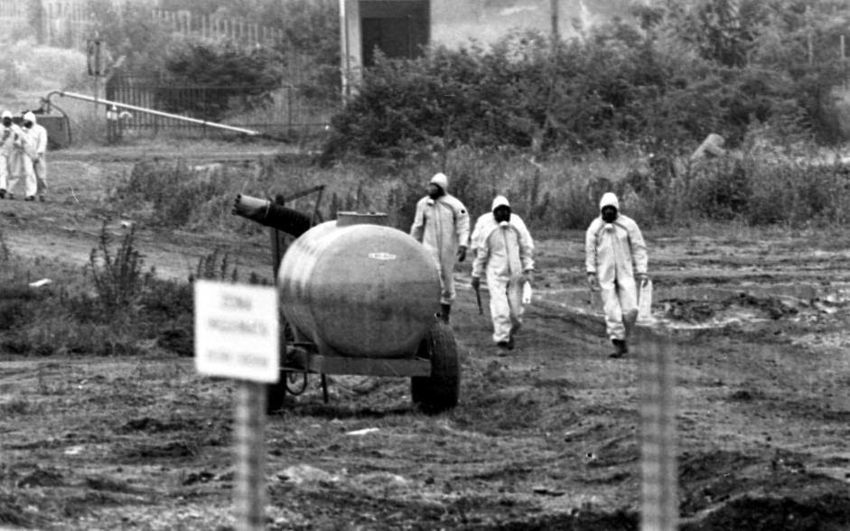

## What happened in Seveso 1976? Give detailed information

In 1976, an accident happened in a chemical plant in Meda, in the vicinity of Seveso (in Lombardy, Italy), which caused the release of 2,3,7,8-tetrachlorodibenzo-p-dioxin (TCDD).
The plant was owned by a company called "Industrie Chimiche Meda Società Azionaria" or ICMESA,
which was owned by Givaudan, which in turn was owned by Hoffmann-La Roche.

### The Accident

The building in which the accident happened was producing 2,4,5-trichlorophenol (used then as a fungicide and herbicide) out of 1,2,4,5-tetrachlorobenzene.

The chemicals in the reactor vessel were heated to a temperature of approximately 160 °C, the heating came from a heating coil transporting 190 °C steam.

On 9th of July 1976, the production process was stopped before the final step that would have removed ethylene glycol from the reaction mixture. while the steam temperature in the heating coil increased to 300 °C. The operators were unaware of that temperature, as there were no readings installed. The increased steam temperature increased the temperature of parts of the reactor jacket ("Reaktormantel"). As the stirrer was turned off when the production process was stopped, parts of the reaction mixture that were close to the part of the reactor jacket were heated up to 180°C, leading to an exothermic reaction in the vessel producing additional heat. 

A few hours later the reaction mixture reached a temperature of 230°C, which led to the opening of a relief valve, which released the toxic mixture in the vessel to 18km^2 of the surrounding area (estimated approx. 15 to 30kg of TCDD).

### Effects of the Accident

- By the end of July 1976, more than 3000 animals, mostly poultry and rabbits died.
- Emergency slaughtering was conducted to prevent TCDD entering the food chain
- Humans exposed to the aerosole cloud reported head aches, nausea, eye irritation
- 19 children were hospitalized
- 640 cases if cloracne were diagnosed
- People in the affected zones were advised not to eat locally grown food or poultry
- People living in the most affected zone had to be evacuated

### Aftermath

- 5 former employees of ICMESA and Givaudan were initially sentenced to prison from 2.5 to 5 years, they all appealed, two persons had to go to prison in 1986

An investigation revealed that the safety systems in the plant were not sufficient
- Only explosion prevention was considered
- No environmental protection 
- No warning system was set up, no protocols were defined for the protection of the local population in case of an accident

The Seveso Directive was passed by the European Community in 1982, called the "Seveso Directive",
it was last updated in 2012 and is now called the "Seveso III Directive".

Source: https://en.wikipedia.org/wiki/Seveso_disaster

### Seveso III Directive

By order of the Directive, *operators of establishments* are required to:
- Notify all concerned establishments
- Issue a major accident prevention policy
- Produce a safety report for upper-tier establishments
- Produce internal emergency plans for upper-tier establishments
- Provide information in case of accidents

Furthermore, Member State authorities are obligated to ensure that the following requirements
are fulfilled:
- External emergency plan for upper-tier establishments are developed
- Land-use planning for the siting of establishments is conducted
- Relevant information is accessible to the public
- Necessary past-accident measures are taken
- Accidents are reported to the European Commission
- The unlawful use of establishments is prohibited
- Inspections are conducted

Source: https://www.umweltbundesamt.de/sites/default/files/medien/376/dokumente/08-03_the_seveso_directive_2012-18-eu_european_union_20190914.pdf