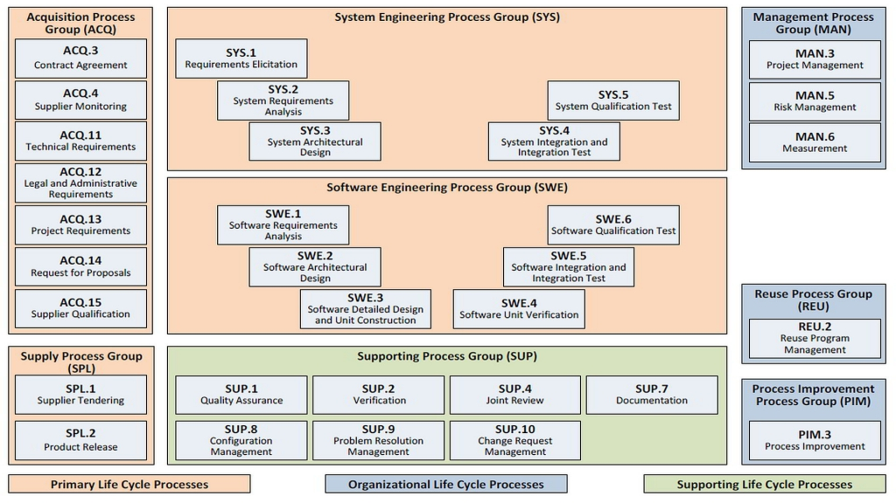

## 7 V-Model

The V-Model is a reference model for software development processes. It divides the whole software development process into a number of phases, which are organized in the shape of a V. It has been derived in the 80s from the "Waterfall Model"

The phases on the left branch of the V are related to the design and implementation, whereas the phases on the right-hand side branch contain tasks related to testing and verification.

The topmost tips of the V describe tasks on the system level, with a high level of abstraction, while the bottom of the V, where left and right branch coalesce, describes the process of design, implementation and testing of a concrete piece of software.

The X Axis of the V describes the order in which the process steps are to be executed, starting with the topmost part on the left side of the V, and ending with the topmost part on its right hand side branch.

Source: https://www.consilia-brno.com/experience/comparison-of-v-model-and-agile-software-development-methodology

The phases that make up the V model, are on the left hand side, going from from top to bottom: 

### System Requirements Elicitation

Requirements on the system that shall be built are collected. User acceptance tests are designed in this phase.

### System Design

Derived from the System Requirements, a high level System Design is created. It describes the principal parts of the system and the interfaces by which they interact. It may also contain descriptions of the underlying data model, descriptions of the user interface, and similar artifacts. Moreover, system tests are designed that shall ensure that the developed system meets all system requrements.

### Architectural Design

In that step, the whole System is broken down into a set of concrete Software Modules, and the interfaces by which they communicate. Moreover, the hardware on which the software executes is selected. At this level, integration test plans are written. 

### Module Design (and Implementation)

Each of the Modules of the system is designed, for instance by means of UML (class diagrams, interaction diagrams, ...). The design contains the description of the parts of a module and its interfaces to the outside. This Module design serves as input to the implementation of that module and as an input to the Design of its Unit Tests.

The phases continue on the right hand side of the V model, from bottom to top:

### Unit (Module) Tests

In this phase, the Unit Test Design is used as an input for the implementation of the Unit (Module) Tests. These tests verify the functionality of a module that can be tested in isolation.

### Integration Tests

Integration Tests are derived from the Integration Test Plans that were created in the Architectural Design phase. These tests ensure that the modules interact as intended.

### System Tests

System tests are implemented according to the system test design. At this level, also the non-functional requirements are tested (like performance, security).

### System Approval/User Acceptance Tests

The execution of the user acceptance tests ensure that the system actually delivers what the customers/users were requesting.

## Standards that incorporate the V Model

- RTCA DO-178C (Aerospace)
- IEC 62304 (Medical Devices)
- Automotive SPICE

Automotive SPICE (Software Process Improvement and Capability dEtermination), which is a framework for assessing
the maturity and capabilities of processes within an organization, incorporates the V model in its Process Reference Model:

Source: https://www.plays-in-business.com/automotivespice/

## Properties of the V Model

Used in industries that are controlled by regulatory bodies that require a proof that quality standards were met when implementing software systems.

The linear nature of the V model does not consider the iterative steps ("feedback loops") used in agile software development.

