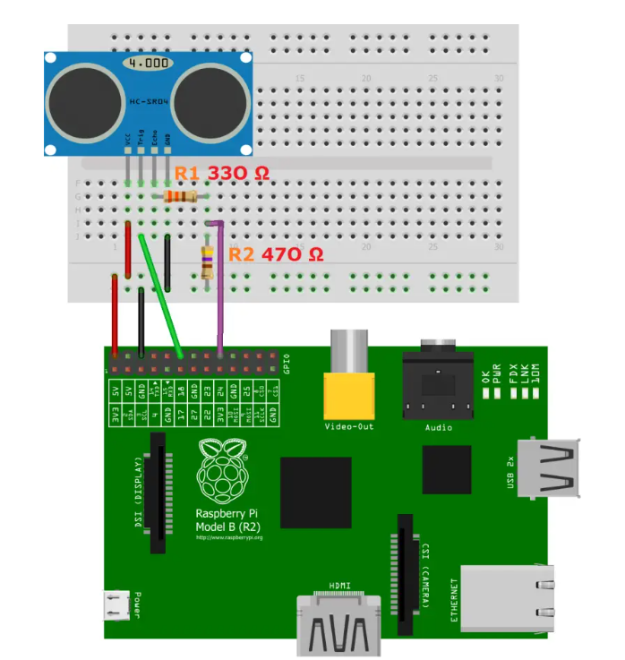

### Build

Prerequisits:
```
git clone https://github.com/joan2937/pigpio.git
cd pigpio
make
sudo make install
```


CMakelist.txt anpassen:
```
project(node1)

add_executable(node1 
    src/main.cpp
    src/sensor.cpp)

# Link with libraries
target_link_libraries(node1 PRIVATE 
    CryptoComm
    pigpio
)

# Include CommonLib headers
target_include_directories(node1 PRIVATE
    ${CMAKE_SOURCE_DIR}/libraries/CryptoComm/include
)
```

Im Verzeichnis src/node1 dann `make -j` ausführen.

### Run

`node1` muss mit `sudo` gestartet werden.   


### Verkabelung



die Angaben bei den Widerständen stimmen nicht.   
R1 = 1K Ohm
R2 = 2K Ohm

Weitere Infos:

https://tutorials-raspberrypi.de/entfernung-messen-mit-ultraschallsensor-hc-sr04/

aber die Angabe zu den widerständen passt dort nicht, daher ignorieren und wie oben geschrieben verwenden.